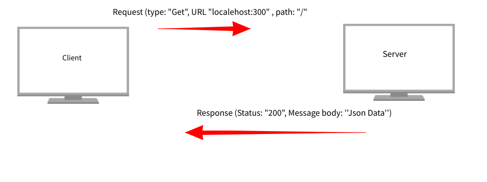

# Movie Library - 1.0

**Author Name**: Jalal Hasan

## WRRC

## Overview

## Getting Started

##### to build this app:

1. Create a package.json file by typing this command in your terminal (npm init -y).
2. install all the dependencies by typing (npm install).
3. install express by typing the command (npm install express)
4. once your done with the installation, just type node server to initialize the server.

## Project Features

1. Search for a specific movie.
2. search for all trending movies: send a git request to endpoint "/trending".
3. get top rated movies by sending a git request to endpoint "/toprated".
4. get results for popular movies by sending a git request to endpoint "/popular".
5. Saving a favorit movie to the database by sending a post request to endpoint "/addMovie".
6. retreiving from favorite movies database by sending a get request to endpoint "/getMovie".
7. updating a specific movie in the database by sending a put request to endpoint ("/udpateFavMovie/id").
8. deleting a movie from the database by sending a delete request to endpoint ("/delete/id").
9. get a single movie from the database by sending a get request with the movie id to the endpoint ("/getFavMovie").

## Task12) update

Other than the two routes required in this task (Search & trending), I've added two other routes (popular & top rated), you can test those routes be adding ("/popular") or ("/toprated") to your request.

#### Task12) What I have learned so far ?

this task was so interesting for me as this is my very first time dealing wih the backend and sending http requests! 😁
it's a little odd for me to be honest, as I am always trying to visualize any application or project I have but still intresting and opens my mind for new ideas and areas to improve.

#### Task12) How long did it take ?

it took around one hour for the task and an extra hour just exploring the new things.

### Task12 update

Other than the two routes required in this task (Search & trending), I've added two other routes (popular & top rated), you can test those routes be adding ("/popular") or ("/toprated") to your request.

### Task13) update

today was my first time dealing with databases, I was really looking forward to this moment, I imagened it will be more complex but turned out it is not. I found it was easy and really fun to deal with.

### Task14) update

I'm really starting to like dealing with a database and manipulating the entries inside of it, can't wait to mix this knowledge with a frontend framework.

this task took less than one hour.

testing
